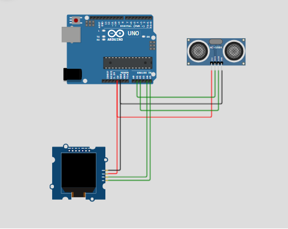

# Arduino-project
Looking back, the actual design and build of this project—which I started about two years ago back in the ninth grade—marks a massive turning point in my academic life. Before throwing myself into this, my understanding of coding and automated systems was pretty much just theoretical. I had the book smarts but no real outlet. This project became the definitive catalyst that hooked me on software engineering and robotics.
## Project Model

